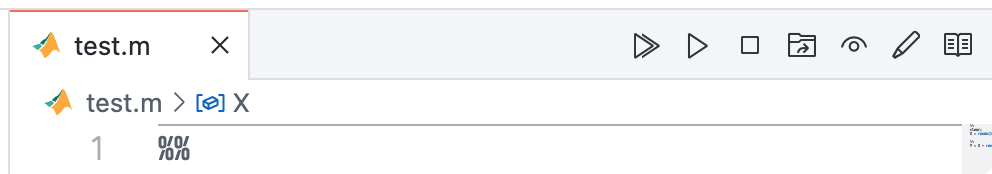
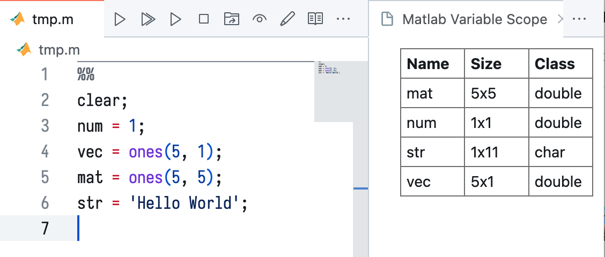
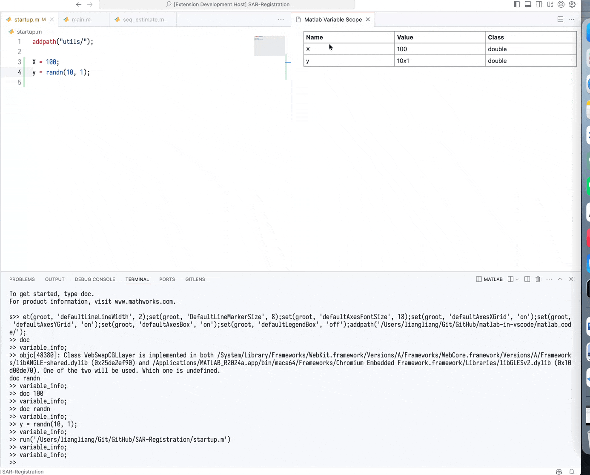
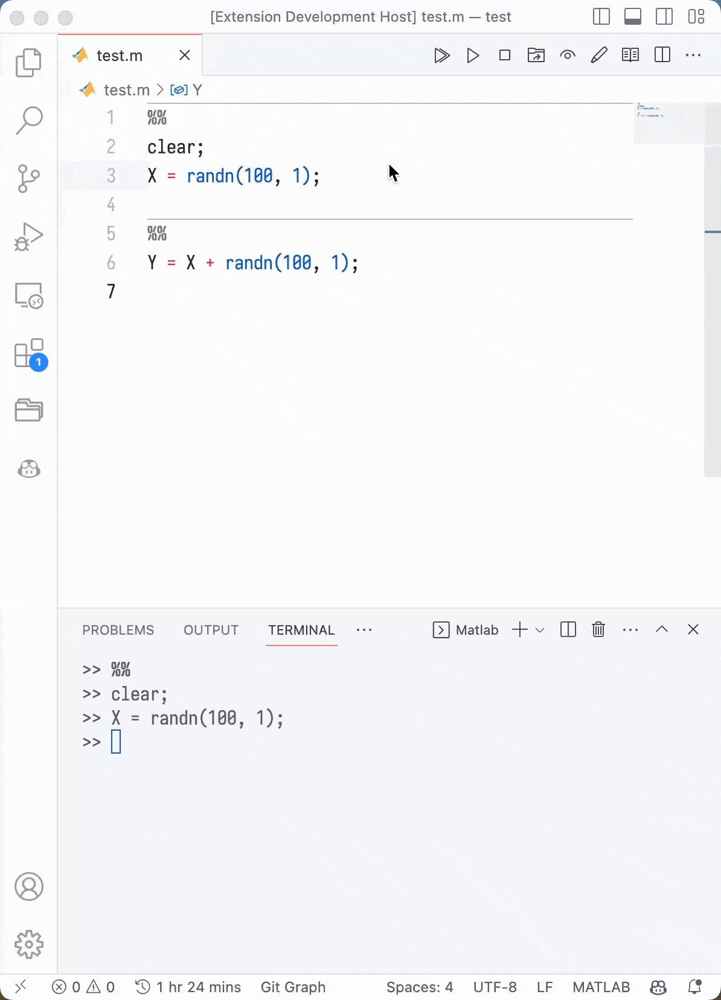
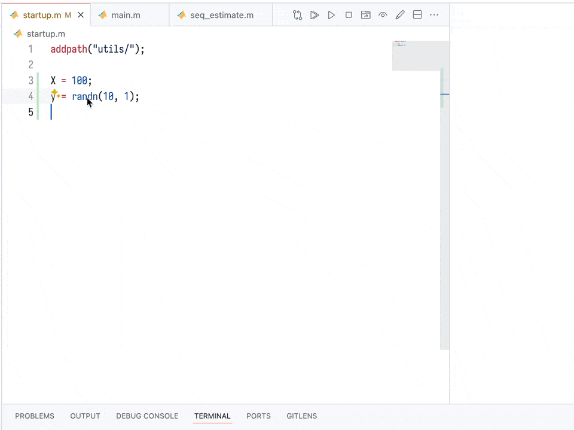

# Matlab in VSCode


This is a VSCode extension for Matlab. It provides the following features.

Major:

-   view variables directly in VSCode
-   run a cell in matlab by press `ctrl+enter` or `cmd+enter`
-   run current line and move to next in matlab by press `shift+enter`
-   syntax highlighting for `.m` file

Minor:

-   run a complete matlab .m file
-   interrupt matlab process by clicking the stop button
-   change the work directory of matlab to the directory of the current file
-   open the workspace of matlab to inspect the variables
-   open the current file in matlab editor for debugging or other purpose

All functions can be accessed by clicking the button in the menu bar. If matlab terminal is not started, the extension will start it automatically. Then, you need to reclick the button to run the command.

<div align=center>
    
</div>

Click [here](https://marketplace.visualstudio.com/items?itemName=shinyypig.matlab-in-vscode) to install the extension.

## Usage

If you are a **windows** user, you may need to installed the MATLAB Engine API for Python, check this [link](https://www.mathworks.com/help/matlab/matlab_external/install-the-matlab-engine-for-python.html) for more details. Then you need to checkout the `matlabPybackend` option in the settings of the extension.

If you are a **linux** or **mac** user, the default settings are fine. Unless the matlab excuable file is not in the path, you can check the `matlabCMD` option in the settings of the extension.

## View Workspace

You can click the button in the menu bar to open a webview to inspect the variables. Though it is not as powerful as the matlab workspace, it is enough for simple inspection.

<div align=center>
    
</div>

Furthermore, you now can click the variable name to see the details of the variable.

<div style="display: flex;justify-content: center; flex-wrap: wrap;">
    
</div>

Notice that a file named `matlabInVSCodeVariableInfo.csv` will be generated in the current directory. It is used to store the variable information. Normally, this file will be automatically deleted immediately. However, if some error occurs, it may not be deleted. You should delete it manually.

**Important!!!** You need to open a folder as workspace in the VSCode to make sure that the extension can find the `matlabInVSCodeVariableInfo.csv` file.

## Cell Mode

You can split your code by `%%`, click the run cell button or simply press `ctrl+enter` (mac: `cmd+enter`) to run the active cell.

<div align=center>
    
</div>

## View Documentation

You can right click the function name and select `Show Matlab Document` to view the documentation of the function.

<div align=center>
    
</div>

## Settings

-   `matlabCMD`: The command to start the Matlab terminal, default is `matlab -nodesktop -nosplash`. If the python backend is used, it will be ignored. In addition, for windows users, it is recommended to use `matlabPybackend`.
-   `matlabMoveToNext`: If set to true, the cursor will move to the next line after running the current line. Default is true.
-   `matlabPybackend`: It is recommended to use the python backend in Windows. Check this [link](https://www.mathworks.com/help/matlab/matlab_external/install-the-matlab-engine-for-python.html) for installing MATLAB Engine API for Python.
-   `matlabPythonPath`: If you want to specify the python path, you can set it here.
-   `matlabStartup`: the code to run after starting the matlab, default is empty, you can add some code to set the default figure style, for example:

    ```json
    "matlab-in-vscode.matlabStartup": [
        "addpath(genpath('./'));",
        "set(groot, 'defaultLineLineWidth', 2);",
        "set(groot, 'DefaultLineMarkerSize', 8);",
        "set(groot, 'defaultAxesFontSize', 18);",
        "set(groot, 'defaultAxesXGrid', 'on');",
        "set(groot, 'defaultAxesYGrid', 'on');",
        "set(groot, 'defaultAxesBox', 'on');",
        "set(groot, 'defaultLegendBox', 'off');",
        "format compact;"
    ],
    ```

## Change Log

See [CHANGELOG.md](CHANGELOG.md).
