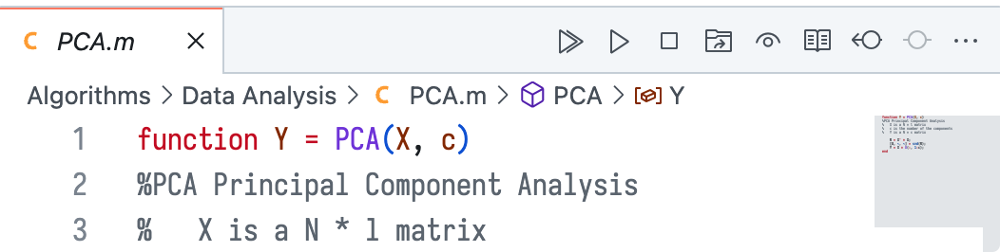
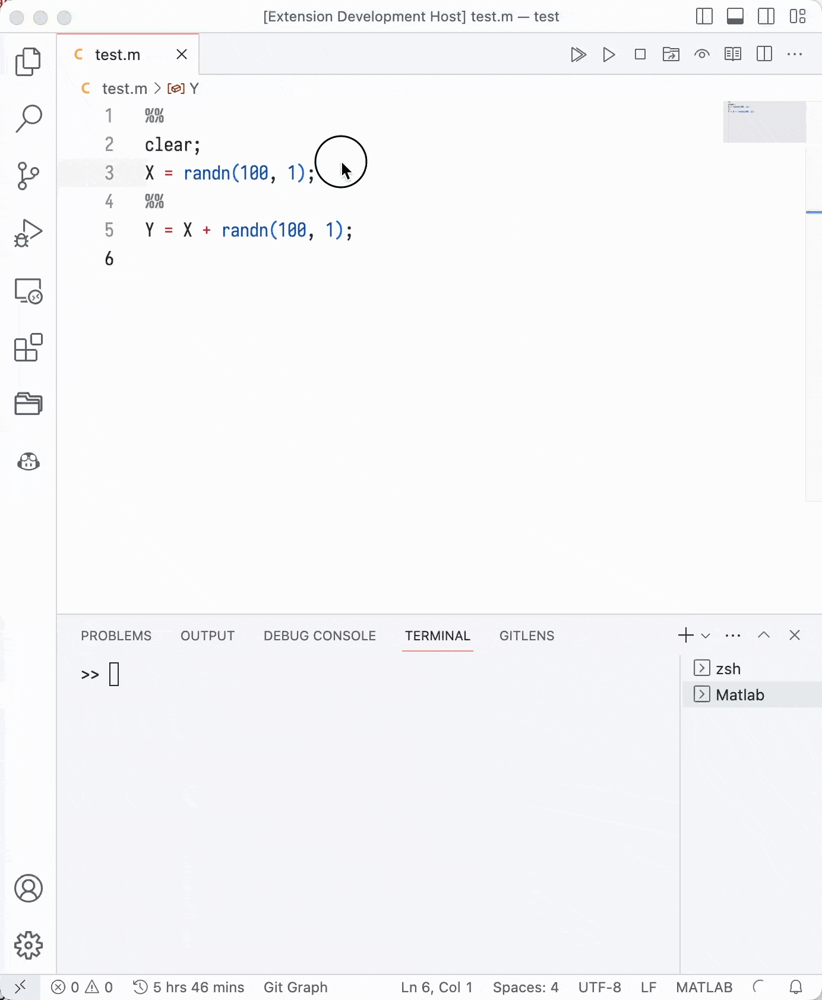

# Matlab in VSCode

This is an VSCode extension for Matlab. It provides the following features:

- run a complete matlab .m file
- run a cell in matlab code by press `ctrl+enter` or `cmd+enter`
- interrupt matlab process by clicking the stop button
- change the work directory of matlab to the directory of the current file
- open the workspace of matlab to inspect the variables
- open the current file in matlab editor for debugging or other purpose

All functions can be accessed by clicking the button in the menu bar.

<div align=center>
    
</div>

## Settings

- `matlabPath`: the path of matlab executable file, default is `matlab`
- `matlabArgs`: the code to run after starting the matlab, default is empty, you can add some code to set the default figure style, for example:

    ```json
    "matlab-in-vscode.matlabArgs": [
        "addpath(genpath('./'));",
        "set(groot, 'defaultLineLineWidth', 2);",
        "set(groot, 'DefaultLineMarkerSize', 8);",
        "set(groot, 'defaultAxesFontSize', 18);",
        "set(groot, 'defaultAxesXGrid', 'on');",
        "set(groot, 'defaultAxesYGrid', 'on');",
        "set(groot, 'defaultAxesBox', 'on');",
        "set(groot, 'defaultLegendBox', 'off');",
        "format compact;"
    ],
    ```

## Cell Mode

You can split your code by `%%`, click the run cell button or simply press `ctrl+enter` (mac: `cmd+enter`) to run the active cell.

<div align=center>
    
</div>

## Release Notes

### 0.0.3

Fix keybinding issue.

### 0.0.2

Add an icon for the extension.

### 0.0.1

First release!!!
